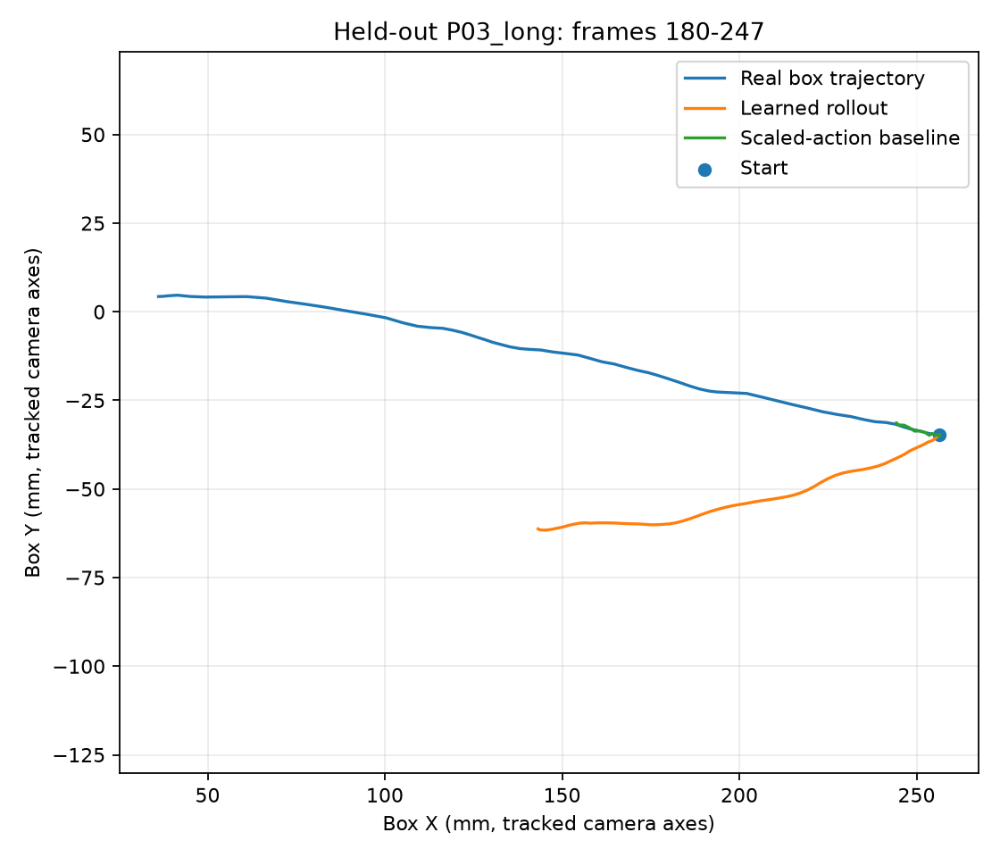

# Real-to-Sim Push World Model

**From phone-recorded tabletop pushes to Franka Panda simulation and a learned box-dynamics predictor.**

This project investigates a practical sim-to-real *modelling* question: **if a robot replays a pusher trajectory measured from video, will the simulated object respond as the real object did?** Three tabletop trials were recorded and tracked with OpenCV. A MuJoCo Franka Panda then replayed the measured 2D pusher paths using Jacobian-based inverse kinematics. Separately, a small action-conditioned world model was trained on two recordings and evaluated on the third.

**Status (8 October 2026):** Three selected real-video motion windows have been replayed in MuJoCo, a contact-tool and settling-control failure was diagnosed and corrected, and a held-out dynamics-model evaluation is complete. This is a proof of concept, **not** a learned robot policy or a model-predictive controller.



## What the system does

```text
Phone video -> colour-based tracking -> calibrated 2D pusher/box trajectories
                                       |                     |
                                       v                     v
                               Cartesian Panda replay   Learned box dynamics
                               (MuJoCo, IK + control)    (Ridge regression)
                                       |                     |
                                       v                     v
                               Simulated box response   Held-out P03 prediction
                                       \_____________________/
                                          Quantitative evaluation
```

The two branches answer **different questions**: the robot replay measures the gap in simulated contact response; the learned world model predicts box movement directly from video-derived states and actions. The learned predictor **does not** control the Panda in the present implementation.

## Key experimental results

### Real video to MuJoCo replay

A rigid capsule pusher was attached to the Panda hand, and the controller was retargeted to its tip site, `panda_pusher_contact`. Each selected video segment was mapped into the simulation frame and executed with damped-least-squares Jacobian IK and bounded static joint-setpoint compensation.

| Selected trial segment | Real box motion | Final simulated box motion | Magnitude error | Pusher-tip tracking RMSE |
|---|---:|---:|---:|---:|
| P01 centre, frames 144–200 | 145.3 mm | 124.2 mm | **21.2 mm** | 9.53 mm |
| P02 offset, frames 132–170 | 60.6 mm | 116.8 mm | 56.2 mm | 10.91 mm |
| P03 long, frames 180–247 | 221.4 mm | 147.6 mm | 73.8 mm | **7.97 mm** |

*Magnitude error* is the absolute difference between the magnitudes of real and simulated box displacement; it does **not** capture directional error. Simulated final movement is measured after the post-push settling interval. The original gripper-based P01 replay moved the cube **45.2 mm** (100.1 mm magnitude error). Switching to the stick-like pusher and compensating static sag produced **124.2 mm** of simulated movement, reducing this particular magnitude error by **78.8%**. Contact logging confirmed `panda_pusher_rod` against the box for **486 simulation steps** in P02 and **892 steps** in P03.

**Interpretation:** end-effector tracking is relatively consistent (about 8–11 mm RMSE) while object-response agreement varies significantly. P02 over-predicts and P03 under-predicts displacement. These results identify a contact/geometry/modelling gap rather than establishing a broadly accurate simulator.

### Held-out learned dynamics model

The model predicts the next **2D box-position increment** from the observed relative pusher/box state, current pusher motion and previous box motion. Inputs are expressed in a local frame aligned with the instantaneous pusher motion. A standardized six-feature **linear Ridge regression** (penalty 10) is fitted without scikit-learn.

- **Training:** P01 frames 144–200 (56 valid steps) and P02 frames 132–170, 229–246 and 293–313 (38, 17 and 18 valid steps); **129 steps** in total.
- **Held-out test:** P03 frames 180–247 (66 directly observed one-step test pairs; a single missing pusher frame is imputed for the separate 68-frame rollout).

| P03 one-step predictor | Euclidean step-error RMSE |
|---|---:|
| **Learned Ridge model** | **1.25 mm** |
| Constant box velocity | 1.31 mm |
| Scaled pusher motion | 3.57 mm |
| Stationary box | 3.76 mm |

The learned model improves on the strongest one-step baseline by approximately **4.6%**, but that margin comes from a single held-out recording and is not evidence of robust generalisation.

| P03 autoregressive rollout | Result |
|---|---:|
| Real box displacement magnitude | 223.76 mm |
| Learned predicted displacement magnitude | 116.28 mm |
| Mean trajectory-position error | 60.01 mm |
| **Final 2D position-vector error** | **125.56 mm** |
| Scaled-action baseline final 2D vector error | 211.20 mm |

The rollout moves in broadly the correct X direction but **undershoots substantially and drifts in the wrong Y direction**. Good one-step, observed-state predictions therefore **do not** translate into reliable long-horizon rollouts. The model is a **dynamics predictor**, not a trained pushing policy, online world model, or planner.

See the [P03 rollout figure](results/world_model/P03_long_180_247_rollout.png) and [evaluation JSON](results/world_model/holdout_P03_long_summary.json).

## Data and protocol

| Recording | Full-video frames | Box detection | Red-pusher detection | Selected replay window |
|---|---:|---:|---:|---|
| `P01_center` | 299 | 99.0% | 55.9% | 144–200 |
| `P02_offset` | 406 | 100.0% | 61.1% | 132–170 |
| `P03_long` | 331 | 100.0% | 51.1% | 180–247 |

P02 also contains detected box-motion episodes at frames **229–246** and **293–313**; these contribute to model training but have **not** been included in the three-run MuJoCo results table above. P03 was recorded as a double push, but the speed-based detector returned one continuous window (180–247) with two acceleration peaks: distinct contact impulses have **not** been independently verified.

Videos were captured with a fixed overhead phone camera and approximately **300 mm** between two blue tape markers. OpenCV/HSV colour segmentation tracks the box and the **red pusher's centroid**, *not its actual physical contact tip*. The pixel-to-millimetre calibration is provisional. When P03 tape markers were unavailable at the start, calibration was taken from P02; the camera position, height and zoom were unchanged according to the experiment record. The tracking frame is **not** a measured camera-to-robot extrinsic calibration.

Full-video pusher coverage is modest because the pusher is sometimes undetected outside push windows; coverage within selected motion windows is much higher (P01 100%, P02 100%, P03 98.5%). The simulation replay rejects large missing-data gaps. The learned-model training discards unobserved transition pairs rather than using interpolated action data.

The committed [`data/processed/pilots/`](data/processed/pilots/) CSVs allow downstream reproduction without access to the personal raw footage. Raw `.mp4` files are excluded from Git. The repository's **current committed** `scripts/extract_pilot.py` is still P01-specific (hardcoded input and output filenames); full video re-extraction of P02/P03 requires the locally adapted extractor and a verified calibration setup. The processed CSVs and replay/model results are the published evaluation artifacts.

## Installation and reproduction

Tested locally on **Windows / VS Code / PowerShell** with Python and MuJoCo. A clean-room installation on a second machine has **not yet been verified**. Commands below assume Python 3.10+ and Git are installed.

```powershell
# Clone this repository
git clone https://github.com/ima-o3/real2sim-push-world-model.git
cd real2sim-push-world-model

# Create a virtual environment
python -m venv .venv
.\.venv\Scripts\Activate.ps1

# Install Python dependencies
python -m pip install --upgrade pip
python -m pip install mujoco numpy pandas opencv-python matplotlib

# Fetch the upstream Panda model (not committed to this repo)
git clone https://github.com/google-deepmind/mujoco_menagerie.git external/mujoco_menagerie

# Apply the reproducible tool-geometry modification
python scripts/install_pusher.py
```

The installer modifies `external/mujoco_menagerie/franka_emika_panda/panda.xml`, backs it up as `panda.xml.bak` (on first run), and verifies that the attached model contains `panda_pusher_contact`. The local Menagerie asset is excluded from this repository; the upstream version is not pinned, so future changes could affect reproducibility.

### Reproduce the MuJoCo replays

The published processed CSVs are included in the repository. The `--dry-run` mode validates the selected video window without launching MuJoCo.

```powershell
python scripts/replay_multi_pilot.py --pilot P02_offset --start-frame 132 --end-frame 170 --dry-run
python scripts/replay_multi_pilot.py --pilot P03_long --start-frame 180 --end-frame 247 --dry-run

# Actual visual MuJoCo replays
python scripts/replay_p01_cartesian.py
python scripts/replay_multi_pilot.py --pilot P02_offset --start-frame 132 --end-frame 170
python scripts/replay_multi_pilot.py --pilot P03_long --start-frame 180 --end-frame 247
```

The Panda simulation uses `configs/push_scene.xml` (2 ms MuJoCo timestep). Replay scripts create joint-position waypoints from camera-derived XY displacements, orient those trajectories using a reference Panda push direction, solve for joint poses offline and run the position actuators with a bounded compensation for static sag. Every event starts from a reset MuJoCo scene: **P02's later actions are not a continuous, state-preserving replay**, and the video's original offset/contact geometry is **not fully matched** by the heading-alignment heuristic.

Results are written to `results/metrics/`, including Cartesian desired/actual tip trajectories and simulated box positions. The P02/P03 event filenames include the selected frame ranges.

### Reproduce the learned-model evaluation

```powershell
python scripts/train_world_model.py --holdout P03_long
```

This script reads the processed pilot CSVs and writes to `results/world_model/`:

- `holdout_P03_long_summary.json` — training split, features, fitted coefficients and evaluation metrics.
- `P03_long_180_247_heldout_rollout.csv` — real, learned and baseline 2D trajectories.
- `P03_long_180_247_rollout.png` — trajectory comparison image.

The evaluation uses **observed previous states for one-step scoring** and **predicted previous states for its autoregressive rollout**. This distinction is essential when interpreting the reported accuracy.

## Repository map

```text
configs/push_scene.xml               MuJoCo tabletop and Panda scene
scripts/extract_pilot.py             Video tracking (committed version: P01-specific)
scripts/install_pusher.py            Add rigid capsule pusher and contact-tip site
scripts/replay_p01_cartesian.py      P01 Cartesian replay + static-sag compensation
scripts/replay_multi_pilot.py        Explicit multi-pilot window replay + contact logging
scripts/train_world_model.py         Ridge model, baselines and held-out rollout
data/processed/pilots/*.csv          Video-derived 2D trajectories
results/metrics/*.csv               Simulated robot/object execution traces
results/world_model/                 Learned-model metrics and comparison plot
```

## Limitations and next steps

1. **Small dataset:** Three videos and 129 selected training transitions; samples within recordings are highly correlated. Cross-recording generalisation has not been established.
2. **Approximate tracking and calibration:** Tape spacing was assumed to be 300 mm, the camera-plane scale is approximate, pusher centroid is not the contact point, and calibration/extrinsics are not fully measured.
3. **Contact-domain mismatch:** The simulated cube mass, friction and geometry are approximate. Video paths are rotated into a common robot heading; initial contact offset and earlier pushes are not reconstructed for every event.
4. **Prediction horizon:** The learned predictor is competitive on observed-state one-step estimates, but its P03 rollout has large final vector and directional error. No online re-planning or closed-loop use of model predictions is implemented.
5. **Reproduction work outstanding:** Pin Python/asset versions, sync the generalized extractor, test from a fresh clone, review visual tracking overlays, and capture/link a demonstration video.

## Acknowledgements

Built using [MuJoCo](https://mujoco.org/), the [MuJoCo Menagerie Franka Panda model](https://github.com/google-deepmind/mujoco_menagerie/tree/main/franka_emika_panda), [OpenCV](https://opencv.org/), NumPy, pandas and Matplotlib. The third-party robot model is fetched separately; refer to the upstream repository for its licensing and attribution requirements.
